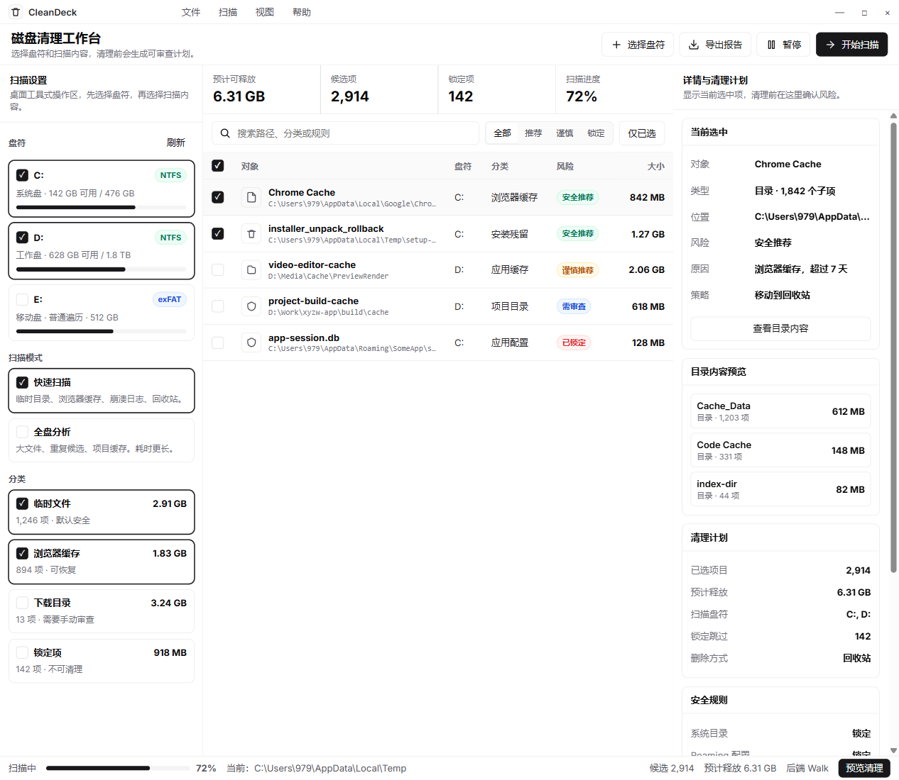

# DiskClean


[](#系统要求)
[](https://tauri.app/)
[](https://react.dev/)
[](https://www.rust-lang.org/)
[](LICENSE)

DiskClean 是一个面向 Windows 的桌面磁盘清理工具，基于 Tauri、React 和 Rust 构建。它会扫描缓存、临时文件、构建产物、日志目录和 Windows 清理项，并在清理前展示风险等级、来源、预计释放空间、保留策略和执行计划。



## 功能亮点

| 能力 | 说明 |
| --- | --- |
| 多盘符扫描 | 支持快速扫描和全盘分析，可按卷选择扫描范围。 |
| 清理前审查 | 每个候选项都会展示风险、原因、来源应用、路径和预计大小。 |
| 保守安全策略 | 系统目录、用户文档、账号状态、数据库、密钥、会话等路径会被锁定或降级为手动审查。 |
| 真实清理进度 | 后端持续上报处理数量、当前路径、百分比和清理结果。 |
| 删除方式可控 | 支持移动到 Windows 回收站，也支持用户显式勾选后的永久删除。 |
| 管理员状态提示 | 非管理员启动时会明确标注，并在可用时提供管理员重启入口。 |
| 自定义规则 | 支持 YAML 规则、HTTPS 规则订阅和 Winapp2 `.ini` 安全子集导入。 |
| 多语言与主题 | 支持中文、英文、日文、法文、德文，并自动跟随系统明暗主题。 |

## 安全设计

DiskClean 默认偏保守，不会把“能删”当成“应该删”：

- 永久删除必须由用户显式启用，默认使用更可恢复的清理路径。
- 回收站清空属于永久删除，内置候选不会默认勾选。
- 浏览器历史、Cookie、登录数据、IndexedDB、Local Storage、SQLite 数据库、钱包、密钥、会话等状态数据会被强制排除或降级。
- 用户文档、桌面、图片、视频、音乐、源码仓库、程序安装目录、Electron 应用主体和依赖安装目录会被锁定或降级。
- npm、pnpm、Yarn、pip、Gradle、NuGet、Cargo 等开发依赖缓存会默认要求用户确认。
- 订阅规则即使声明 `default: true`，也需要经过本地校验和用户确认后才会进入扫描。

## 项目结构

```text
apps/desktop/                 Tauri + React 桌面应用
apps/desktop/src/             React UI、状态管理、IPC API 和测试
apps/desktop/src-tauri/       Tauri/Rust 桌面壳、系统命令和本地存储
crates/cleaner-core/          扫描、规则校验、清理计划和执行核心
rules/default-rules.yaml      内置保守清理规则
docs/custom-rules.md          自定义规则编写说明
docs/design/                  设计说明和界面预览
```

## 系统要求

- Windows 10/11
- Node.js 18+ 和 pnpm
- Rust stable
- Tauri v2 所需的 Windows 构建工具

## 本地开发

```powershell
pnpm install
pnpm dev
```

常用命令：

| 命令 | 用途 |
| --- | --- |
| `pnpm dev` | 启动桌面应用开发环境。 |
| `pnpm lint` | 运行 TypeScript 类型检查。 |
| `pnpm test` | 运行前端单元测试。 |
| `pnpm build` | 构建前端产物。 |
| `pnpm tauri build` | 打包 Tauri 桌面安装包。 |
| `cargo test` | 运行 Rust 工作区测试。 |

## 打包产物

Tauri 打包成功后，安装包默认输出到：

```text
target/release/bundle/msi/
target/release/bundle/nsis/
```

## 自定义规则

DiskClean 支持在规则面板中编写 YAML 规则，也支持加载 HTTPS 订阅：

```yaml
version: 1
name: Local cache rules
publisher: local
rules:
  - id: example.tool.cache
    name: 示例工具缓存
    app: ExampleTool
    category: 开发工具缓存
    level: 需要确认
    default: false
    paths:
      - "%LOCALAPPDATA%\\ExampleTool\\Cache"
    clean: contents
    keep_days: 7
    close:
      - example.exe
    note: 删除后可重新生成，但会影响下次启动或下载速度。
```

完整字段、路径约束、安全降级和 Winapp2 导入策略见 [docs/custom-rules.md](docs/custom-rules.md)。

## 贡献

欢迎提交问题、规则补充和改进建议。涉及清理行为的改动请优先说明：

- 目标路径为什么可以清理。
- 删除后是否可重新生成。
- 是否可能影响账号、会话、配置、数据库或用户文件。
- 默认勾选是否足够保守。

## 许可证

本项目基于 [MIT License](LICENSE) 开源。
