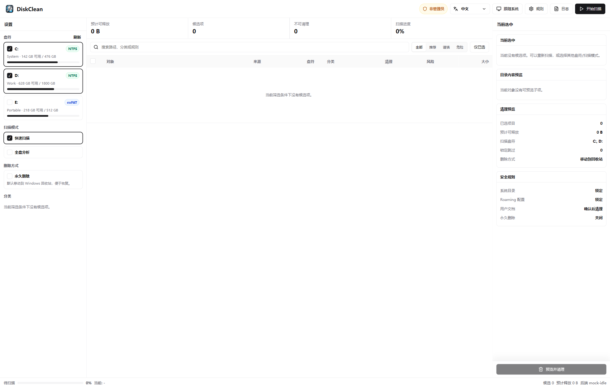
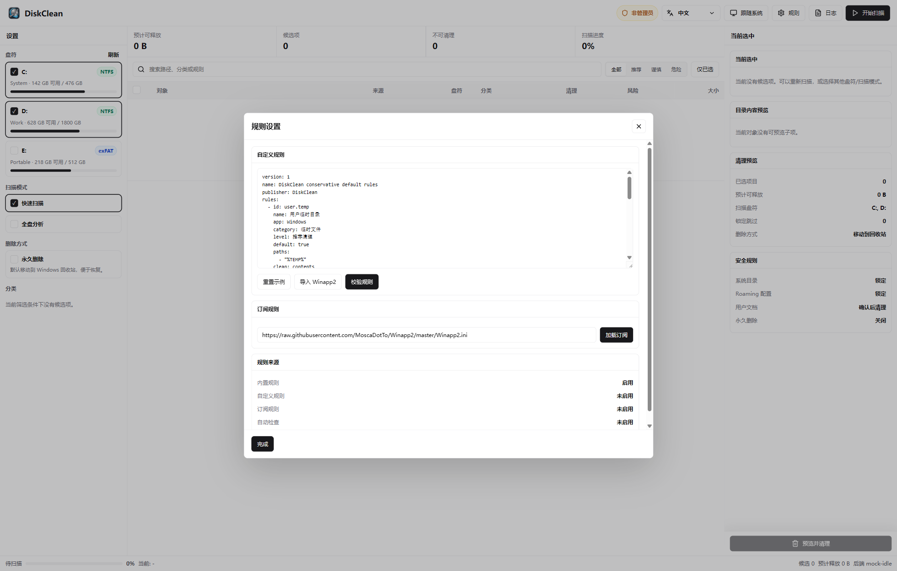
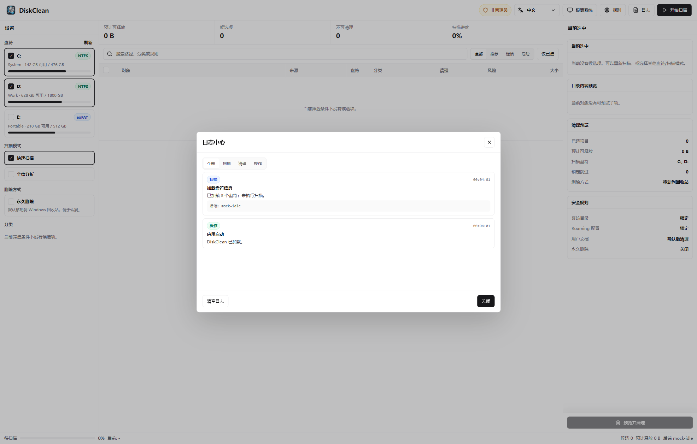

# DiskClean


[](#系统要求)
[](https://tauri.app/)
[](https://react.dev/)
[](https://www.rust-lang.org/)
[](LICENSE)

DiskClean 是一个面向 Windows 的桌面磁盘清理工具，基于 Tauri、React 和 Rust 构建。它会按用户选择的磁盘卷扫描缓存、临时文件、构建产物、日志目录和 Windows 清理项，并在清理前展示风险等级、来源、预计释放空间、保留策略和执行计划。对于 NTFS 卷，全盘分析会优先使用 USN/MFT 快速索引；该能力需要管理员权限，非管理员运行时会自动回退到递归扫描。

## 界面预览

<p align="center">
  
</p>

| 规则设置 | 日志中心 |
| --- | --- |
|  |  |

## 功能亮点

### 扫描与筛选

| 能力 | 说明 |
| --- | --- |
| 多盘符选择 | 自动加载本机卷信息，可按 C/D/E 等盘符选择扫描范围。 |
| 按卷执行扫描 | 扫描请求会把已选盘符传给后端；候选项按所属盘符归档，并可在 UI 中继续按盘符过滤。 |
| 双扫描模式 | 快速扫描用于常见缓存和规则命中，全盘分析会对选中的每个磁盘卷做更完整的候选发现。 |
| 管理员加速扫描 | NTFS 全盘分析会优先读取 USN/MFT 快速索引；该特性需要管理员权限，非管理员模式会回退为递归扫描，结果仍可用但速度更慢。 |
| 实时扫描状态 | 展示扫描进度、当前后端状态、候选数量、不可清理数量和预计释放空间。 |
| 搜索与过滤 | 支持按路径、分类、规则、风险级别和“仅已选”快速收敛候选项。 |
| 分类视图 | 按临时文件、浏览器缓存、开发依赖缓存、Windows 清理项等分类组织结果。 |

### 候选审查

| 能力 | 说明 |
| --- | --- |
| 风险分级 | 候选项分为推荐、谨慎、危险/需要确认、不可清理等状态。 |
| 来源识别 | 基于 Registry、AppData 路径、Steam 清单、项目目录标记和内置路径规则识别来源应用。 |
| 详情侧栏 | 展示当前候选的来源、路径、风险原因、清理策略、锁定状态和预计释放空间。 |
| 子项预览 | 支持预览目录内容，帮助确认清理范围是否符合预期。 |
| 默认勾选保守 | 只有明确安全、可再生的缓存才可能默认选中，高风险对象默认要求人工确认。 |

### 清理执行

| 能力 | 说明 |
| --- | --- |
| 清理前计划 | 执行前生成清理计划，统计已选项目、预计释放空间、锁定跳过项和删除方式。 |
| 删除方式可控 | 默认移动到 Windows 回收站；永久删除必须由用户显式勾选。 |
| 真实清理进度 | 后端持续上报处理数量、当前路径、百分比和阶段状态。 |
| 可暂停/取消 | 扫描和清理流程提供暂停、继续、取消等控制入口。 |
| 结果汇总 | 清理完成后汇总已清理、跳过、失败原因、释放空间和逐项结果。 |

### 规则系统

| 能力 | 说明 |
| --- | --- |
| 本地规则库 | 只有用户批准的规则才会进入扫描；空库不会回退到打包 YAML。 |
| YAML 自定义规则 | 支持在规则面板直接编写、校验，保存并批准后才会启用。 |
| HTTPS 规则订阅 | 支持加载 `.yaml`、`.yml`、`.ini` 订阅，订阅内容会做大小、编码和 URL 校验。 |
| Winapp2 导入 | 可导入 Winapp2 `.ini` 的安全子集，`RegKey` 和高风险状态数据不会直接执行。 |
| 安全降级 | 规则命中系统目录、用户数据、数据库、会话、密钥、依赖安装目录等路径时会降级或取消默认勾选。 |

### 可观测性与桌面体验

| 能力 | 说明 |
| --- | --- |
| 日志中心 | 按扫描、清理、操作分类记录关键事件、耗时、后端状态和规则加载结果。 |
| 管理员状态 | 明确显示管理员/非管理员状态；非管理员时提示并提供管理员重启入口，以启用 NTFS USN/MFT 快速索引能力。 |
| 多语言界面 | 支持中文、英文、日文、法文、德文。 |
| 主题模式 | 支持浅色、深色和跟随系统主题。 |
| 桌面打包 | 基于 Tauri v2，可打包为 Windows 安装包。 |

## 安全设计

DiskClean 默认偏保守，不会把“能删”当成“应该删”：

- 永久删除必须由用户显式启用，默认使用更可恢复的清理路径。
- 回收站清空属于永久删除，内置候选不会默认勾选。
- 浏览器历史、Cookie、登录数据、IndexedDB、Local Storage、SQLite 数据库、钱包、密钥、会话等状态数据会被强制排除或降级。
- 用户文档、桌面、图片、视频、音乐、源码仓库、程序安装目录、Electron 应用主体和依赖安装目录会被锁定或降级。
- npm、pnpm、Yarn、pip、Gradle、NuGet、Cargo 等开发依赖缓存会默认要求用户确认。
- 订阅规则即使声明 `default: true`，也需要经过本地校验和用户确认后才会进入扫描。

## 项目结构

```text
apps/desktop/                 Tauri + React 桌面应用
apps/desktop/src/             React UI、状态管理、IPC API 和测试
apps/desktop/src-tauri/       Tauri/Rust 桌面壳、系统命令和本地存储
crates/cleaner-core/          扫描、规则校验、清理计划和执行核心
rules/default-rules.yaml      示例规则文档（运行时不再自动加载）
docs/custom-rules.md          自定义规则编写说明
docs/design/                  设计说明和界面预览
```

## 系统要求

- Windows 10/11
- Node.js 18+ 和 pnpm
- Rust stable
- Tauri v2 所需的 Windows 构建工具

## 本地开发

```powershell
pnpm install
pnpm dev
```

常用命令：

| 命令 | 用途 |
| --- | --- |
| `pnpm dev` | 启动桌面应用开发环境。 |
| `pnpm lint` | 运行 TypeScript 类型检查。 |
| `pnpm test` | 运行前端单元测试。 |
| `pnpm build` | 构建前端产物。 |
| `pnpm tauri build` | 打包 Tauri 桌面安装包。 |
| `cargo test` | 运行 Rust 工作区测试。 |

## 打包产物

Tauri 打包成功后，安装包默认输出到：

```text
target/release/bundle/msi/
target/release/bundle/nsis/
```

## 自定义规则

DiskClean 支持在规则面板中编写 YAML 规则，也支持加载 HTTPS 订阅：

```yaml
version: 1
name: Local cache rules
publisher: local
rules:
  - id: example.tool.cache
    name: 示例工具缓存
    app: ExampleTool
    category: 开发工具缓存
    level: 需要确认
    default: false
    paths:
      - "%LOCALAPPDATA%\\ExampleTool\\Cache"
    clean: contents
    keep_days: 7
    close:
      - example.exe
    note: 删除后可重新生成，但会影响下次启动或下载速度。
```

完整字段、路径约束、安全降级和 Winapp2 导入策略见 [docs/custom-rules.md](docs/custom-rules.md)。

## 贡献

欢迎提交问题、规则补充和改进建议。涉及清理行为的改动请优先说明：

- 目标路径为什么可以清理。
- 删除后是否可重新生成。
- 是否可能影响账号、会话、配置、数据库或用户文件。
- 默认勾选是否足够保守。

## 许可证

本项目基于 [MIT License](LICENSE) 开源。
