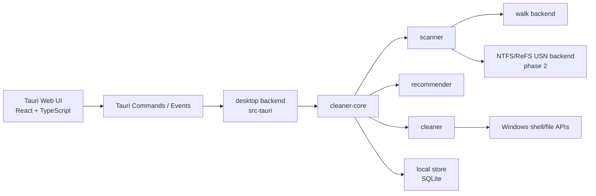
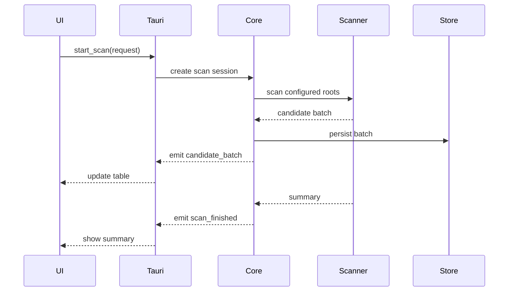

# Rust 磁盘清理桌面应用详细设计

## 1. 背景

目标是构建一个桌面应用，用于快速扫描硬盘垃圾文件、给出分级清理建议，并允许用户在清理前单选、勾选、批量选择。核心诉求是扫描速度、安全清理和明确可控的 UI。

本设计以 Windows MVP 为第一阶段目标，技术路线采用 **Tauri + Rust Core + TypeScript UI**。Rust 负责扫描、分类、推荐、清理和系统 API；Tauri 前端负责交互、表格、筛选、进度和确认流程。

## 2. 目标

### 2.1 产品目标

- 快速扫描常见垃圾目录，并流式显示扫描结果。
- 支持用户选择一个或多个盘符作为扫描范围。
- 支持按风险等级推荐清理项。
- 支持分类选择、单项勾选、全选、反选、仅推荐项。
- 清理前必须预览和确认。
- 默认不清理高风险文件。
- 默认优先使用可恢复删除方式，例如 Windows Recycle Bin。

### 2.2 技术目标

- 扫描核心独立为 Rust crate，UI 可替换。
- 第一阶段支持 Windows 10/11。
- 普通文件系统使用安全目录遍历。
- NTFS/ReFS 后续支持直接 `$MFT` 风格快速通道（完整空间核算）。
- exFAT/FAT32 使用普通遍历和应用层缓存优化。
- 单元测试纳入 Trellis Phase 2.2，作为独立必需步骤。

## 3. 非目标

- 不做注册表清理。
- 不做驱动级磁盘操作。
- 不把 `FSCTL_ENUM_USN_DATA` 当作完整空间核算后端（USN 记录无 size）。
- 不默认永久删除文件。
- 不自动清理用户文档、桌面、项目目录。
- 不在 MVP 阶段做重复文件深度比对。

## 4. 技术选型

### 4.1 UI 技术

推荐：

```text
Tauri v2 + React + TypeScript + TanStack Table / Virtual
```

原因：

- Rust 后端和 Tauri 集成直接，扫描核心不需要 FFI 桥接。
- Web UI 更适合复杂表格、虚拟滚动、筛选和多选状态管理。
- Tauri 打包体积通常小于 Electron。
- Windows 10/11 环境下 WebView2 依赖可通过安装器处理。

备选：

- Flutter Desktop + Rust FFI：UI 表现力强，但 Rust 通信和打包复杂度更高。
- Slint/egui/iced：单语言更纯粹，但复杂数据表和成熟 UI 体验成本更高。

### 4.2 Rust 核心依赖建议

| 能力 | 建议依赖 | 说明 |
|---|---|---|
| 并发遍历 | `ignore`, `jwalk`, `rayon` | MVP 先用安全遍历，后续按性能替换 |
| Windows API | `windows` | 调用 `GetVolumeInformationW`, `IFileOperation`, `DeviceIoControl` |
| 序列化 | `serde`, `serde_json` | Tauri IPC 数据模型 |
| 错误处理 | `thiserror`, `anyhow` | core 用 typed error，app 边界用 anyhow |
| 持久化 | `rusqlite` | 本地扫描缓存、历史记录、规则版本 |
| 日志 | `tracing`, `tracing-subscriber` | 扫描、清理、权限失败诊断 |
| 时间 | `time` 或 `chrono` | 文件年龄和清理规则 |

## 5. 总体架构



建议仓库结构：

```text
disk-cleaner-desktop/
├─ apps/
│  └─ desktop/
│     ├─ src/                    # React UI
│     └─ src-tauri/              # Tauri app shell
├─ crates/
│  ├─ cleaner-core/              # 平台无关核心模型、规则、调度
│  ├─ scanner-walk/              # 普通遍历扫描后端
│  ├─ scanner-windows/           # Windows volume / USN / recycle bin
│  └─ cleaner-testkit/           # 测试 fixture 和 fake filesystem
├─ docs/
│  └─ design/
└─ .trellis/
```

## 6. 核心模块

### 6.1 `cleaner-core`

职责：

- 定义扫描请求、扫描结果、候选项、风险等级。
- 管理扫描任务生命周期。
- 聚合不同 scanner backend。
- 调用推荐规则生成默认勾选状态。
- 生成清理计划。
- 暴露稳定 API 给 Tauri 后端。

核心接口草案：

```rust
pub trait ScannerBackend {
    fn capability(&self, volume: &VolumeInfo) -> BackendCapability;
    fn scan(&self, request: ScanRequest, sink: ScanSink) -> Result<ScanSummary, ScanError>;
}

pub trait Recommender {
    fn classify(&self, entry: &FileEntry, context: &ScanContext) -> CleanupCandidate;
}

pub trait Cleaner {
    fn preview(&self, selection: CleanupSelection) -> Result<CleanupPlan, CleanupError>;
    fn execute(&self, plan: CleanupPlan, sink: CleanupSink) -> Result<CleanupReport, CleanupError>;
}
```

### 6.2 `scanner-walk`

普通文件系统遍历后端。

适用：

- NTFS fallback
- ReFS fallback
- exFAT
- FAT32
- removable drives
- network shares
- 权限不足场景

设计要点：

- 默认不跟随 symlink / junction / reparse point。
- 遇到权限失败记录 warning，不中断整个扫描。
- 扫描结果按批次发送，避免 UI 或 IPC 被大量单项压垮。
- 并发数按磁盘类型和目录粒度控制。
- 支持取消：每个目录批次检查 cancellation token。

### 6.3 `scanner-windows`

Windows 平台能力模块。

职责：

- 枚举 volume。
- 调用 `GetVolumeInformationW` 获取 filesystem name。
- 判断 backend capability。
- 调用 recycle bin / shell delete API。
- Phase 2 实现 USN 快速通道。

文件系统能力矩阵：

| 文件系统 | MVP 扫描 | 快速索引 | 增量能力 | 说明 |
|---|---:|---:|---:|---|
| NTFS | 普通遍历 | Phase 2: USN/MFT 风格枚举 | Phase 2: USN Journal | 第一优先级 |
| ReFS | 普通遍历 | Phase 2: 尝试 USN | Phase 2: 验证后启用 | 需要单独兼容测试 |
| exFAT | 普通遍历 | 不支持 | 应用层缓存 | 无 NTFS 类 USN/MFT 快速通道 |
| FAT32 | 普通遍历 | 不支持 | 应用层缓存 | 无文件变更日志 |
| 网络盘 | 普通遍历 | 不支持 | 应用层缓存 | 需要降速和超时策略 |

### 6.4 `recommender`

负责把扫描对象转为 `CleanupCandidate`。扫描对象不只包括文件，也包括目录、目录组和虚拟来源，例如 Recycle Bin。

风险等级：

```text
SafeRecommended
  默认勾选。典型：临时目录中过期文件、浏览器缓存、崩溃 dump。

CautiousRecommended
  展示推荐但默认不一定勾选。典型：下载目录安装包、大型压缩包、应用缓存。

ReviewRequired
  必须用户手动选择。典型：用户目录中的大文件、未知应用目录。

Blocked
  不允许清理。典型：系统目录、应用配置、当前运行中锁定文件。
```

推荐规则输入：

- 路径位置。
- 对象类型：file、directory、virtual_group。
- 文件扩展名。
- 文件大小。
- 目录聚合大小、子项数量、最大子项大小。
- 修改时间。
- 访问时间，仅当平台可靠时使用。
- 所属 volume。
- 是否系统/隐藏/只读。
- 是否在白名单/黑名单。
- 是否匹配已知缓存目录规则。
- 是否为运行中应用的活跃缓存。
- 是否包含配置、数据库、账号、索引、会话等高风险文件特征。

推荐规则输出：

```text
candidate_id
path
display_name
category
size_bytes
risk_level
default_selected
reason_codes
delete_strategy
object_type
children_preview_available
confidence
```

### 6.5 应用缓存识别

应用缓存不能简单按 `cache`、`temp` 字符串清理。识别结果必须包含置信度和风险等级。

识别信号：

| 信号 | 用途 |
|---|---|
| Known cache path rule | 例如 Chrome/Edge/Firefox cache、Electron app cache、Windows Temp |
| App identity | 通过安装目录、包名、进程名、manifest、known vendor path 识别所属应用 |
| Path scope | `LocalAppData` 下缓存通常比 `Roaming` 配置更安全 |
| File pattern | `.tmp`, `.log`, crash dump, shader cache, HTTP cache 可提高置信度 |
| Negative pattern | `config`, `settings`, `profile`, `session`, `token`, `wallet`, `database`, `IndexedDB` 等降低或阻断 |
| Last modified / locked state | 最近活跃或被进程占用时降级或跳过 |
| Rule provenance | 内置规则、用户规则、社区规则需要不同信任级别 |

分类策略：

```text
AllowClean
  高置信缓存目录，且不含高风险负面特征。默认可勾选。

ReviewClean
  可能是缓存，但包含项目目录、下载目录、未知应用路径，或最近活跃。默认不勾选。

BlockClean
  配置、账号、数据库、Roaming profile、运行中锁定文件、系统目录。不可清理。
```

规则库建议：

```text
cache_rules/
├─ builtin/
│  ├─ windows.yaml
│  ├─ browsers.yaml
│  ├─ developer-tools.yaml
│  └─ office-tools.yaml
├─ user/
│  └─ custom.yaml
└─ subscriptions/
   └─ <subscription-id>.yaml
```

规则格式必须面向普通用户，YAML 字段保持简洁，并在示例中提供中文注释。用户和订阅规则只描述“哪里可以扫、怎么展示、如何保守清理”，不能描述任意脚本或命令执行。

示例：

```yaml
# CleanDeck 自定义清理规则
# version: 规则文件版本，当前固定为 1
version: 1

rules:
  # id: 规则唯一标识，建议使用 app.用途
  - id: npm.cache

    # name: 界面显示名称
    name: npm 缓存

    # app: 来源应用，用于分组和“来源”列
    app: npm

    # category: 清理分类
    category: 开发工具缓存

    # level: 推荐清理 / 谨慎清理 / 需要确认
    level: 推荐清理

    # default: 是否默认勾选；最终仍会受 CleanDeck 安全校验影响
    default: true

    # paths: 支持有限环境变量，例如 %LOCALAPPDATA%、%APPDATA%、%USERPROFILE%、%TEMP%
    paths:
      - "%LOCALAPPDATA%\\npm-cache"

    # clean: contents / files / recycle / manual
    clean: contents

    # keep_days: 保留最近几天的文件，避免清理刚生成的缓存
    keep_days: 3

    # close: 清理前建议关闭的进程
    close:
      - node.exe
      - npm.exe

    # exclude: 规则自己的排除项；CleanDeck 还会追加内置强制排除项
    exclude:
      - "**\\*.db"
      - "**\\*.sqlite"
      - "**\\*token*"
      - "**\\*session*"
      - "**\\*backup*"

    # note: 给用户看的中文说明
    note: npm 包下载缓存，删除后可重新下载，但下次安装依赖可能变慢。
```

字段约束：

| 字段 | 必填 | 说明 |
|---|---:|---|
| `id` | 是 | 文件内唯一，只允许字母、数字、点、横线、下划线 |
| `name` | 是 | UI 展示名称 |
| `app` | 是 | 来源应用或厂商 |
| `category` | 是 | UI 分类 |
| `level` | 是 | `推荐清理`、`谨慎清理`、`需要确认` |
| `default` | 否 | 默认 `false`；最终会受安全校验降级 |
| `paths` | 是 | 仅允许绝对路径、受支持环境变量和 glob |
| `clean` | 否 | `contents`、`files`、`recycle`、`manual`，默认 `manual` |
| `keep_days` | 否 | `推荐清理` 默认 3 天，`谨慎清理` 默认 7 天 |
| `close` | 否 | 进程名列表，用于运行态降级或跳过 |
| `exclude` | 否 | 用户可读的排除 glob |
| `note` | 是 | 中文解释：为什么可清理、清理后的影响 |

### 6.6 自定义规则与订阅规则

规则来源分级：

| 来源 | 信任级别 | 默认行为 |
|---|---|---|
| 内置规则 | 高 | 可默认推荐，但仍要通过运行态校验 |
| 用户自定义规则 | 中 | 本机用户明确创建；危险命中会降级 |
| 订阅规则 | 低 | 需要来源展示、更新确认和更严格默认选择策略 |

订阅链接 MVP 只支持：

```text
https://example.com/cleandeck-rules.yaml
https://example.com/cleandeck-rules.yml
https://raw.githubusercontent.com/<owner>/<repo>/<branch>/windows.yaml
```

订阅链接 MVP 不支持：

```text
http://
file://
ftp://
*.txt
短链接
需要登录或 Cookie 的链接
超过 2 MB 的规则文件
```

订阅更新策略：

- 仅接受 UTF-8 YAML。
- 必须包含 `version: 1` 和 `rules`。
- 下载后先写入临时位置，验证通过后原子替换。
- 新版本验证失败时继续使用上一份有效规则。
- 记录 source URL、内容 hash、更新时间、规则数量、失败原因。
- 订阅新增 `default: true` 的规则时，UI 必须提示用户确认后才允许默认勾选。
- 用户可暂停、删除、手动刷新订阅。

安全边界：

- YAML 是配置，不是脚本；用户和订阅规则不能声明 shell、PowerShell、注册表编辑、服务操作、驱动操作或提权。
- CleanDeck 内置强制排除项始终生效，规则文件不能覆盖。
- 命中系统目录、应用安装目录、用户文档、桌面、图片、视频、项目目录、CleanDeck 自身数据、扫描数据库、日志、规则文件时必须阻断。
- 命中 `token`、`session`、`wallet`、`keychain`、`credential`、`backup`、`recovery`、`autosave`、`profile`、`IndexedDB`、`Local Storage`、`*.db`、`*.sqlite` 等特征时必须降级或阻断。
- `default: true` 只有在最终风险等级仍为 `推荐清理` 时才生效。
- 清理前仍必须生成 preview plan，逐项展示路径、来源规则、风险、预计释放空间和跳过原因。

运行态校验：

- 清理前重新 stat 文件或目录。
- 如果目录大小、mtime、子项数量明显变化，标记 stale 并要求重新扫描。
- 如果文件被锁定或应用正在运行，默认跳过或降级为 ReviewRequired。
- 目录清理必须逐子项执行，不能只按路径递归删除后不记录明细。

## 7. 扫描流程

### 7.1 快速扫描 MVP

第一阶段不做全盘深扫，先做高价值目录：

```text
%TEMP%
%LOCALAPPDATA%\Temp
%LOCALAPPDATA%\CrashDumps
browser cache directories
Recycle Bin
Downloads large installers, optional
```

流程：



### 7.2 全盘扫描 Phase 2

全盘扫描引入 volume-aware backend：

```text
VolumeDetector
  -> NTFS: direct $MFT inventory if permitted, else FileIdExtdDirectoryInfo / WalkScanner
  -> ReFS: WalkScanner (until verified)
  -> exFAT/FAT32: WalkScanner
  -> network/removable: WalkScanner with throttling
```

NTFS 直接 `$MFT` 通道注意事项：

- 以管理员可读的卷设备句柄打开目标卷，定位并流式解析 `$MFT` FILE 记录。
- 从 `$DATA` 取得 logical/allocated size；hard link 按 file identity 去重 allocated bytes。
- `FSCTL_ENUM_USN_DATA` **不得**作为完整空间核算后端（记录无 size）。
- 权限不足或解析失败时必须有感 fallback 到目录枚举，并在 coverage 中记录 `accessDenied` / `backendFallback`。

### 7.3 增量扫描 Phase 2

缓存策略：

- 首次扫描记录 volume serial number、filesystem、root path、path hash、mtime、size。
- NTFS/ReFS 可用时，记录 USN journal checkpoint。
- 下次扫描优先读取变更记录。
- exFAT/FAT32 只能用路径、mtime、size 做应用层增量判断。

### 7.4 目录候选与子项查看

扫描结果应统一建模为 `CleanupObject`，支持文件和目录：

```text
CleanupObject
  File
  Directory
  VirtualGroup
```

目录候选规则：

- 目录行展示聚合大小、子项数量、风险等级、推荐原因。
- UI 允许在右侧详情面板查看目录内容预览。
- 大目录使用懒加载分页，不一次性把所有子项推给前端。
- 目录被选中时，默认表示选择该目录下所有可清理子项；Blocked 子项仍然必须跳过。
- 目录展开后允许对子项取消勾选。
- 清理计划必须展开成具体子项执行，报告需要记录每个失败项。

子项查询 IPC：

```text
list_candidate_children(candidate_id, query) -> CandidatePage
```

## 8. 清理流程

### 8.1 清理计划

用户点击清理前，必须生成 `CleanupPlan`：

```text
selected candidates
  -> validate candidate still exists
  -> verify risk policy
  -> estimate reclaim size
  -> split by delete strategy
  -> show confirmation
```

### 8.2 删除策略

| 策略 | 默认 | 说明 |
|---|---:|---|
| MoveToRecycleBin | 是 | Windows 优先，便于恢复 |
| PermanentDelete | 否 | 高级选项，需要二次确认 |
| AppManagedQuarantine | Phase 2 | 移动到应用隔离区，适合跨平台 |
| Skip | 是 | 高风险、锁定、权限不足 |

### 8.3 安全约束

- `Blocked` 项不能被 UI 强行勾选。
- `ReviewRequired` 必须用户手动勾选。
- 删除前重新 stat 文件，防止扫描后文件变化。
- 如果文件大小或 mtime 变化，标记为 stale 并跳过。
- 清理失败不影响其他项，但要保留错误报告。
- 默认不提升权限；管理员能力作为后续明确功能。

## 9. UI 设计

### 9.1 页面结构

UI 应采用桌面工具工作台，而不是网页 dashboard。主窗口固定高度，核心区域内部滚动。

```text
Desktop Window
├─ Title Bar
│  ├─ App name
│  ├─ File / Scan / View / Help menu
│  └─ Window controls
├─ Command Bar
│  ├─ Current workspace title
│  ├─ Select drives
│  ├─ Export report
│  ├─ Pause
│  └─ Start scan
├─ Workbench
│  ├─ Left Pane: scan settings
│  │  ├─ Drive selector
│  │  ├─ Scan mode
│  │  └─ Category checklist
│  ├─ Center Pane: scan results
│  │  ├─ Summary strip
│  │  ├─ Search and risk filters
│  │  └─ Candidate table
│  └─ Right Pane: details and cleanup plan
│     ├─ Selected item details
│     ├─ Cleanup plan
│     └─ Safety rules
└─ Status Bar
   ├─ Scan progress
   ├─ Current path
   ├─ Candidate count
   ├─ Estimated reclaim size
   └─ Preview cleanup action
```

### 9.2 关键交互

- 扫描前提供盘符选择区，展示盘符、文件系统、容量占用、是否支持快速索引。
- 支持单盘符和多盘符扫描；未选择盘符时不允许启动扫描。
- 盘符选择、扫描模式、分类勾选应放在左侧常驻设置面板，不放在长页面顶部。
- 候选文件表格位于中央主区域，内部滚动，表头固定。
- 中央表格命名为候选对象表，不限定为文件；对象可以是文件、目录或虚拟分组。
- 右侧详情面板显示当前选中项的路径、对象类型、风险、推荐原因、删除策略和清理计划。
- 选中目录时，右侧详情面板显示子项预览，并提供“查看目录内容”入口。
- 底部状态栏常驻显示扫描进度、当前路径、候选数、预计释放空间，并提供主清理入口。
- 扫描中实时显示：
  - 已扫描路径数
  - 已发现候选项
  - 可释放空间估算
  - 当前目录
  - 跳过/权限失败数
- 分类支持：
  - 临时文件
  - 浏览器缓存
  - 回收站
  - 日志和崩溃文件
  - 下载目录大文件
  - 其他可审查项
- 表格支持：
  - 虚拟滚动
  - 按大小排序
  - 按风险筛选
  - 按分类筛选
  - 分组全选
  - 单项勾选

## 10. Tauri IPC 设计

### 10.1 Commands

```text
start_scan(request) -> scan_id
cancel_scan(scan_id) -> void
get_scan_summary(scan_id) -> ScanSummary
list_candidates(scan_id, query) -> CandidatePage
list_candidate_children(candidate_id, query) -> CandidatePage
update_selection(scan_id, selection_patch) -> SelectionSummary
preview_cleanup(scan_id, selection) -> CleanupPlan
execute_cleanup(plan_id) -> CleanupReport
get_history(query) -> HistoryPage
```

### 10.2 Events

```text
scan:started
scan:progress
scan:candidate_batch
scan:warning
scan:finished
scan:cancelled
cleanup:progress
cleanup:finished
cleanup:failed
```

### 10.3 批处理策略

- candidate batch 默认 200 到 1000 条。
- 大字段不重复发送，例如 category/risk reason 使用 code。
- UI 只保存当前页和选择摘要，完整结果存在 SQLite。

## 11. 数据模型

### 11.1 核心模型

```text
VolumeInfo
  id
  mount_point
  filesystem
  serial_number
  is_removable
  capability

ScanEntry
  path
  object_type
  size_bytes
  children_count
  modified_at
  created_at
  attributes
  volume_id

CleanupCandidate
  id
  scan_id
  path
  object_type
  category
  size_bytes
  children_count
  risk_level
  default_selected
  selected
  reason_codes
  delete_strategy
  confidence

CleanupPlan
  id
  scan_id
  selected_count
  total_size_bytes
  strategy_groups
  warnings

CleanupReport
  id
  plan_id
  deleted_count
  skipped_count
  failed_count
  reclaimed_bytes
  errors
```

### 11.2 SQLite 表

```text
scan_sessions
scan_candidates
cleanup_plans
cleanup_reports
volume_cache
rule_versions
rule_sources
rule_subscriptions
settings
```

## 12. 性能设计

### 12.1 扫描性能

- 快速扫描先扫高价值目录，不默认全盘。
- 普通遍历使用目录级并发，不对每个文件创建任务。
- 对 HDD 降低并发，避免随机 IO 放大。
- 对 SSD 可提高并发，但要限制 IPC batch。
- 权限失败和路径错误聚合上报，不逐条阻塞 UI。

### 12.2 UI 性能

- 表格必须虚拟滚动。
- 文件列表分页/增量加载。
- 选择状态用 candidate id set 和 category summary，不对全量数组重复 diff。
- 大量 candidate 更新使用 batch reducer。

### 12.3 指标

MVP 建议记录：

```text
scan_duration_ms
scanned_dirs
scanned_files
candidate_count
candidate_size_bytes
permission_denied_count
backend_used
fallback_reason
cleanup_duration_ms
cleanup_success_count
cleanup_failed_count
```

## 13. 错误处理

错误分级：

```text
RecoverableWarning
  单个目录权限失败、文件已不存在、文件被占用。

ScanDegraded
  快速通道不可用，已 fallback 到普通遍历。

BlockingError
  扫描根目录无效、数据库不可写、清理计划损坏。

SafetyBlock
  文件命中系统目录、高风险路径、扫描后状态变化。
```

UI 展示原则：

- 不用错误弹窗打断普通权限失败。
- 清理前展示风险和跳过项。
- 清理后提供失败明细。

## 14. 安全策略

默认禁止清理：

- `C:\Windows`
- `C:\Program Files`
- `C:\Program Files (x86)`
- 用户文档、桌面、图片、视频、项目目录
- AppData Roaming 配置目录
- 当前应用自身数据目录
- 当前扫描数据库和日志文件

默认可推荐：

- OS 临时目录。
- 用户 Local Temp。
- 浏览器 cache。
- crash dump。
- recycle bin。
- 经过内置规则确认的可再生成应用缓存。

规则系统附加安全要求：

- 订阅规则和用户规则不能绕过默认禁止清理列表。
- 订阅规则默认信任等级低于内置规则。
- 规则文件本身、订阅缓存、本地日志和扫描数据库不可被任何规则清理。
- 规则更新不能自动扩大默认清理范围，除非用户明确确认。

## 15. Trellis 工作流要求

本项目把单元测试作为独立质量门禁，而不是最终检查的附带项。

流程：

```text
Phase 1 Plan
  -> 1.1 PRD
  -> 1.2 技术研究
  -> 1.3 上下文整理

Phase 2 Execute
  -> 2.1 Implement
  -> 2.2 Unit test pass
  -> 2.3 Simplification review
  -> 2.4 Quality review

Phase 3 Finish
  -> 3.1 Final verification
  -> 3.2 Spec update
```

Phase 2.2 必须执行：

- 识别变更模块。
- 按 `.trellis/spec/guides/unit-test-criticality-guide.md` 分类。
- 添加或更新聚焦单元测试。
- 先跑 scoped test，再按风险跑 workspace test。
- 记录测试命令和缺口。
- 如果 2.3 简化阶段改了代码或测试，必须回到 2.2 重新跑相关测试。

## 16. 单元测试策略

### 16.1 模块测试等级

| 模块 | 默认等级 | 测试要求 |
|---|---|---|
| `cleaner-core` | P0 | 推荐规则、清理计划、安全阻断、状态机必须覆盖 |
| `scanner-windows` | P0 | volume 检测、backend 选择、USN fallback、安全删除封装必须覆盖 |
| `scanner-walk` | P1 | 遍历、权限失败、取消、reparse point 跳过 |
| `apps/desktop/src-tauri` | P1 | IPC 命令参数、任务生命周期、错误映射 |
| `apps/desktop/src` state/model | P2 | 选择状态、筛选、批处理 reducer |
| 纯展示组件 | P3 | 仅必要 smoke test |

### 16.2 必测场景

扫描：

- 空目录。
- 普通文件。
- 深层目录。
- 大量文件 batch。
- 权限失败。
- 文件扫描中被删除。
- reparse point / symlink 不跟随。
- cancel scan。

推荐：

- temp 过期文件默认推荐。
- 下载目录大文件默认谨慎。
- 系统目录 blocked。
- 用户文档 review required。
- 文件年龄边界。

清理：

- 生成 preview plan。
- stale 文件跳过。
- blocked 文件不能进入执行计划。
- 部分成功、部分失败。
- recycle bin 策略 fallback。

UI state：

- category 全选。
- 单项取消。
- 仅推荐项选择。
- 风险筛选后选择摘要保持正确。

## 17. 实施分期

### Phase A: 项目骨架

- 初始化 Tauri + React + TypeScript。
- 初始化 Rust workspace。
- 建立 `cleaner-core` 模型。
- 建立 Trellis workflow 和测试指南。

### Phase B: 快速扫描 MVP

- 实现 Windows 常见目录扫描。
- 实现 candidate 分类。
- 实现流式 batch event。
- 实现扫描 UI 和候选表格。

### Phase C: 安全清理

- 实现 preview cleanup。
- 实现 Recycle Bin 删除。
- 实现清理报告。
- 加入失败明细和日志。

### Phase C2: 规则系统

- 实现内置 YAML 规则加载。
- 实现用户自定义 YAML 规则导入和校验。
- 实现 HTTPS YAML 订阅添加、手动更新、原子替换和验证错误展示。
- 实现规则来源、风险降级、强制排除和规则说明展示。

### Phase D: 全盘与快速通道

- volume detector。
- NTFS USN prototype。
- fallback 策略。
- 增量缓存。

## 18. 验收标准

- Windows 10/11 上应用可启动。
- 快速扫描能在 UI 中实时显示进度和结果。
- 候选项包含路径、大小、分类、风险等级、推荐原因。
- 候选项包含命中的规则来源和中文说明。
- 用户可单选、多选、分类全选。
- 默认只勾选 `SafeRecommended`。
- 清理前展示 preview plan。
- 清理后展示 report。
- 单元测试在 Trellis Phase 2.2 独立执行并记录。
- `cleaner-core` 的推荐和安全策略有 P0 测试覆盖。
- YAML 规则解析、订阅 URL 校验、强制排除和风险降级有 P0 测试覆盖。

## 19. 关键风险

- WebView2 环境缺失：通过 Tauri installer 配置安装模式处理。
- 全盘扫描慢：MVP 先做快速扫描，Phase 2 再做 NTFS USN。
- 权限不足：所有 scanner backend 必须支持 fallback 和 warning。
- 误删风险：默认 recycle bin，blocked 路径不可清理，执行前重新校验。
- 规则订阅风险：只接受 HTTPS YAML，禁止任意命令执行，订阅新增默认勾选项必须确认。
- UI 大数据卡顿：必须 batch + virtual table。

## 20. 参考资料

- Tauri v2 Architecture: https://v2.tauri.app/concept/architecture/
- Tauri Windows Installer: https://v2.tauri.app/distribute/windows-installer/
- Microsoft File System Functionality Comparison: https://learn.microsoft.com/en-us/windows/win32/fileio/filesystem-functionality-comparison
- FSCTL_ENUM_USN_DATA: https://learn.microsoft.com/en-us/windows/win32/api/winioctl/ni-winioctl-fsctl_enum_usn_data
- Microsoft Master File Table: https://learn.microsoft.com/en-us/windows/win32/fileio/master-file-table
